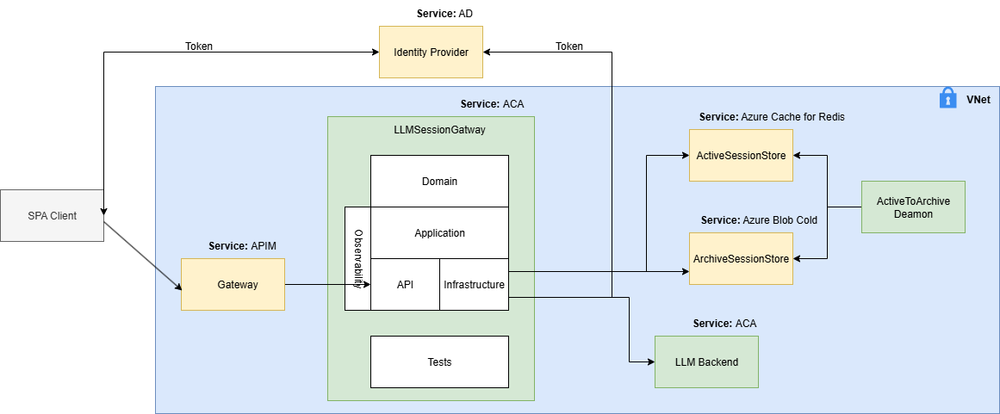

# LLMSessionGateway

An enterprise-grade, secure, and observable gateway between users and any AI model — providing full session management, resilience, and preventing data leakage. This AI-model-agnostic API gateway enables session-aware interaction with LLMs without persisting user data on the provider side, ensuring full GDPR compliance, operational safety, and end-to-end observability through structured logging and distributed tracing.

##✨ Why LLMSessionGateway?
- **GDPR-Compliant — Keeps sensitive data out of AI providers.
- **Enterprise Security — Keycloak for authentication + Kong Gateway for secure routing and HTTPS enforcement.
- **High Performance — Redis for active sessions, gRPC for low-latency model communication.
- **Cloud-Native — Optimized for Azure Container Apps or AKS.
- **Observable by Default — Structured logs + distributed tracing for every request.

## 

## ✨ Key Features

- **Clean Architecture**
  - Separation of concerns across Application, Domain, Infrastructure, and API layers.
  - Dependency inversion with clear interfaces (`IChatSessionOrchestrator`, `IActiveSessionStore`, `IArchiveSessionStore`, `IChatBackend`).

- **Resilient Communication**
  - gRPC-based backend abstraction for AI model connections.
  - Deadlines and cancellation tokens propagated from controller to gRPC calls.
  - Automatic retry policies and fault handling.

- **Session Management**
  - Active sessions stored in Redis for fast retrieval.
  - Archived sessions persisted to Azure blob storage cool tier.
  - Idempotency via MessageId to prevent duplicate message sends.

- **Observability**
  - Structured logging with Serilog for centralized search and analysis.
  - Distributed tracing with OpenTelemetry.
  - TraceId and Correlation-Id across all components.

- **Security & Compliance**
  - Full support for Azure AD authentication and APIM Gateway for token validation and routing.
  - HTTPS transport and GDPR-aligned data retention.

- **Error Handling**
  - Unified `Result<T>` and `Unit` types for functional error management.
  - Consistent error responses for API consumers.
 
- **Operational Safety**
  - Health checks for Redis, Azure Blob Storage, and gRPC backend.
  - Readiness and liveness endpoints (/ready, /health).
  - Request size limits and JSON depth restrictions.
  - Configuration validation on startup (IOptions.ValidateOnStart).

- **Testing**
  - Comprehensive unit test coverage using xUnit and Moq.
  - Production-minded test scenarios including cancellation and fault simulation.

## 🛠️ Technologies

- **.NET 8** – modern, high-performance runtime for building APIs
- **gRPC** – efficient communication with the AI model server over HTTP/2
- **Azure Cache for Redis** – fast in-memory store for active sessions
- **Azure.Storage.Blobs** – durable storage for archived sessions
- **Serilog** – structured logging for observability
- **OpenTelemetry** – distributed tracing and metrics collection
- **Polly** – resilience policies (retries, fallback)
- **xUnit, Moq, Fluent Assertions** – comprehensive unit testing framework
