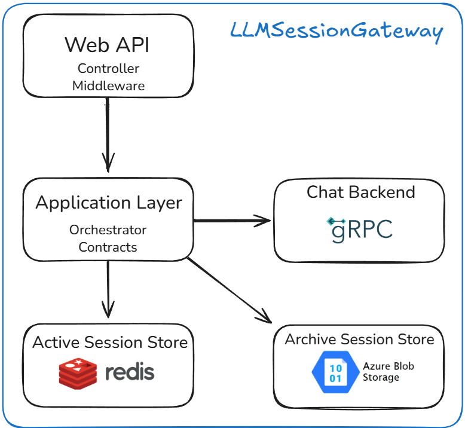
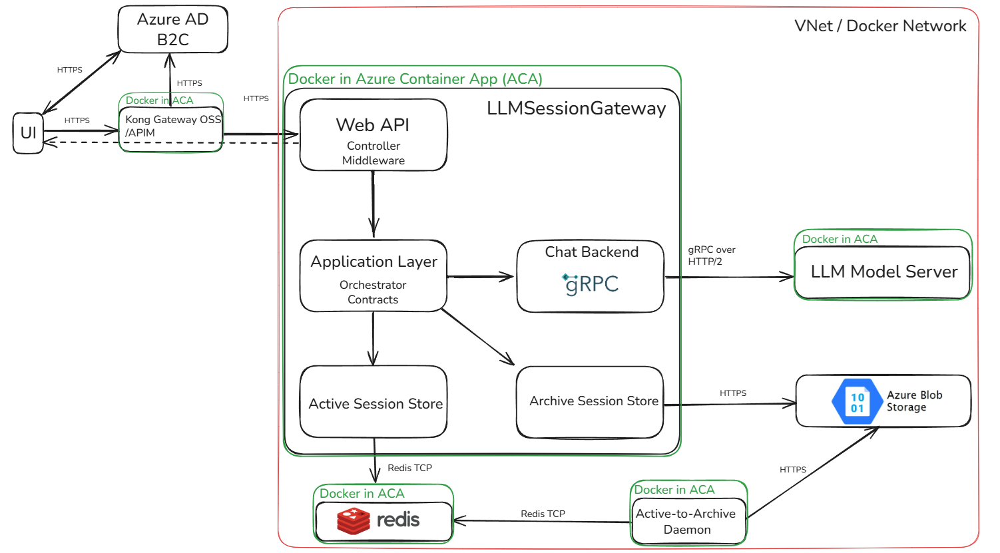

# LLMSessionGateway

An enterprise-grade, secure, and observable gateway between users and any AI model — providing full session management and preventing data leakage. This AI-model-agnostic API gateway enables session-aware interaction with LLMs without persisting user data on the provider side, ensuring full GDPR compliance and end-to-end observability through structured logging and distributed tracing.

## API Architecture Overview

<em>Figure 1: Clean architecture of the API components</em>

## System Architecture Overview

<em>Figure 2: Production deployment topology in Azure</em>

## ✨ Key Features

- **Clean Architecture**
  - Separation of concerns across Application, Domain, Infrastructure, and API layers.
  - Dependency inversion with clear interfaces (`IChatBackend`, `ISessionManager`, `IActiveSessionStore`, `IArchiveSessionStore`).

- **Resilient Communication**
  - gRPC-based backend abstraction for AI model connections.
  - Automatic retry policies and fault handling.

- **Session Management**
  - Active sessions stored in Redis for fast retrieval.
  - Archived sessions persisted to Azure blob storage cool tier.

- **Observability**
  - Structured logging with Serilog for centralized search and analysis.
  - Distributed tracing with OpenTelemetry.
  - TraceId across all components.

- **Security & Compliance**
  - Full support for Azure AD B2C authentication, HTTPS transport, and GDPR-aligned data retention.

- **Error Handling**
  - Unified `Result<T>` and `Unit` types for functional error management.
  - Consistent error responses for API consumers.

- **Testing**
  - Comprehensive unit test coverage using xUnit and Moq.
  - Production-minded test scenarios including cancellation and fault simulation.

## 🛠️ Technologies

- **.NET 8** – modern, high-performance runtime for building APIs
- **gRPC** – efficient communication with the AI model server over HTTP/2
- **Redis (StackExchange.Redis)** – fast in-memory store for active sessions
- **Azure.Storage.Blobs** – durable storage for archived sessions
- **Serilog** – structured logging for observability
- **OpenTelemetry** – distributed tracing and metrics collection
- **Polly** – resilience policies (retries, fallback)
- **xUnit, Moq, Fluent Assertions** – comprehensive unit testing framework

## 🛠️ Environments

### 🧪 Development
- **Docker Network** – isolated local networking between containers
- **Docker Compose** – orchestrates all services locally
- **Azure AD B2C (test tenant)** – identity provider for authentication
- **Kong Gateway OSS (local container)** – API gateway handling token validation and routing
- **Azurite** – local emulator for Azure Blob Storage

### 🚀 Production
- **Azure VNet** – secure private network for all components
- **Azure Container Registry (ACR)** – stores production Docker images
- **Azure Container Apps** or **Azure Kubernetes Service (AKS)** – deploy and scale containers
- **Azure AD B2C (production tenant)** – production-grade authentication
- **Azure API Management (APIM)** – managed API gateway for security and observability
- **Azure Blob Storage (cool tier)** – durable archive storage for session data